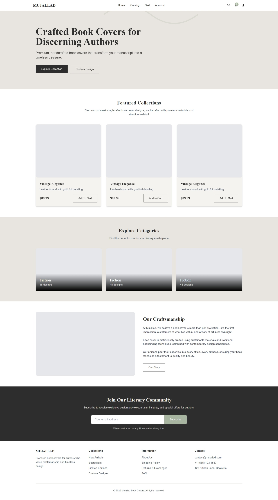
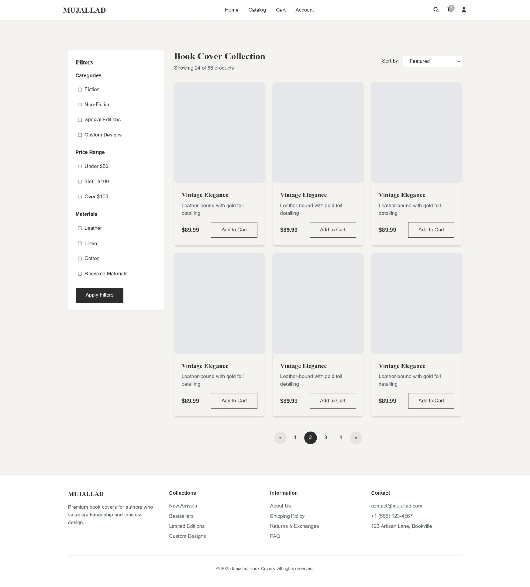
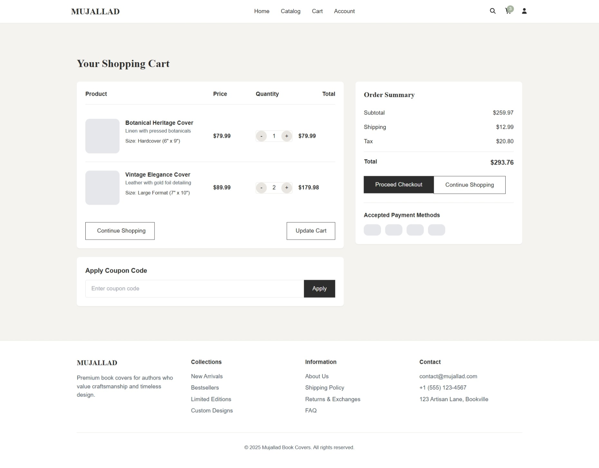
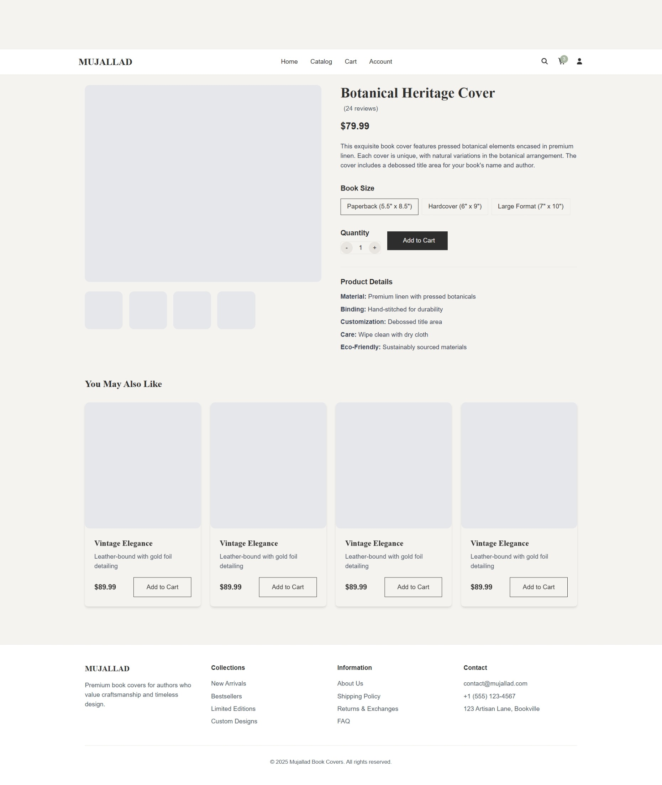
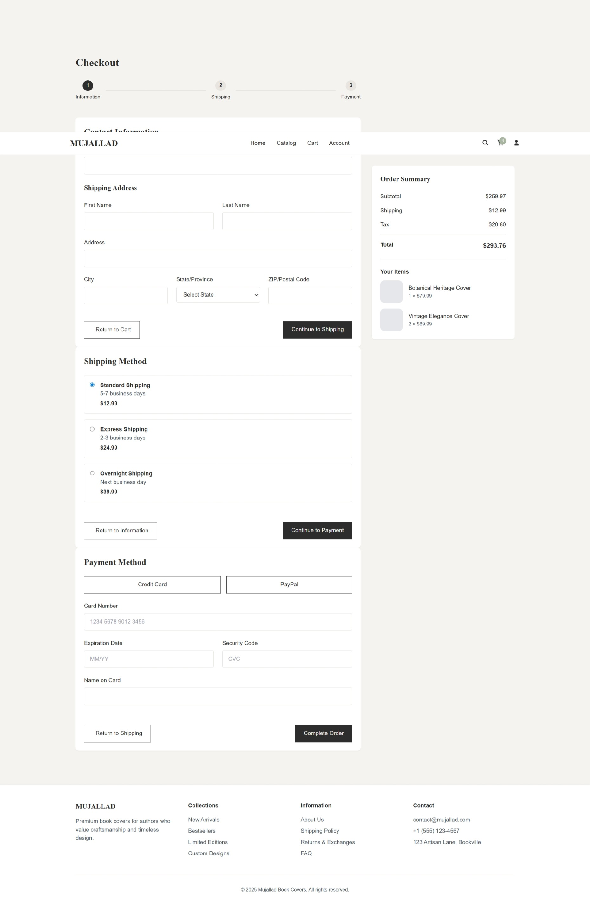
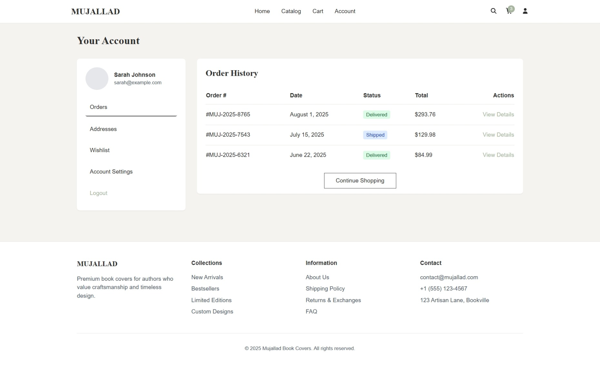
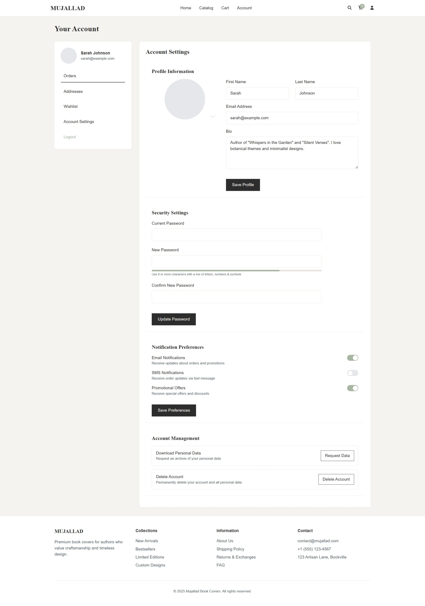
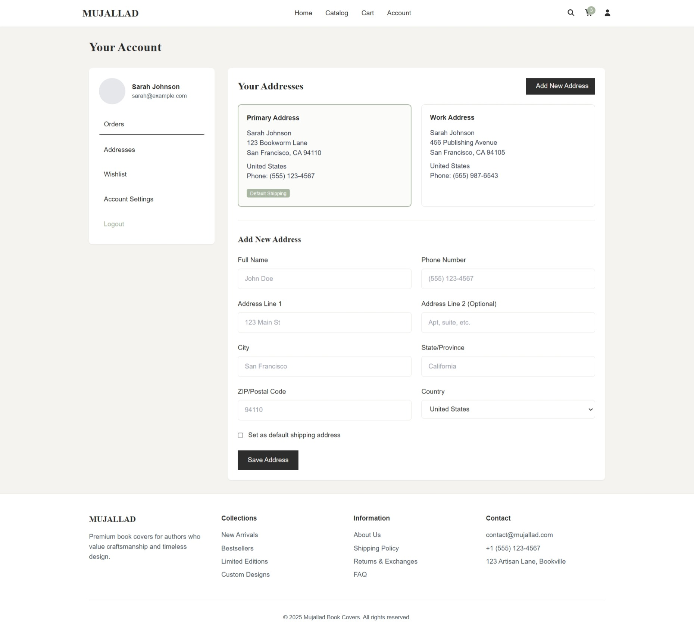
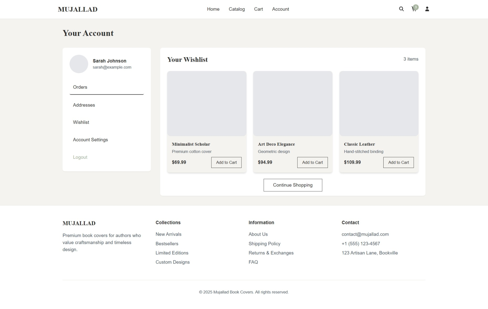

# Mujaled Demo Website

This is the **Mujaled** demo website design, built using **Angular** and **Tailwind CSS**.  
It is a **front-end only** project created to showcase the layout and visual style — no backend or CRUD functionality is implemented.

---

## 🚀 Pages Designed

- **Home Page** – Showcases products and highlights.
- **Cart Page** – Displays items added by the user (static demo).
- **Product Details Page** – Static product information view.
- **Checkout Page** – Visual flow for checkout.
- **Dashboard Page** – Demo admin/user overview.
- **Profile Page** – Static profile layout.
- **Favourite Page** – Demo list of saved products.

---

## 🛠️ Tech Stack

- **Angular** – Front-end framework.
- **Tailwind CSS** – Utility-first CSS framework.
- **Responsive Design** – Optimized for desktop, tablet, and mobile.

---

## 📸 Screenshots

> All screenshots are from the demo design (no live data or functionality).

### 1. Home Page

### 2. catalog Page

### 3. Cart Page

### 4. Product Details Page

### 5. Checkout Page

### 6. Dashboard Page

### 7. Profile Page

### 8. addresses Page

### 9. wishlist Page

